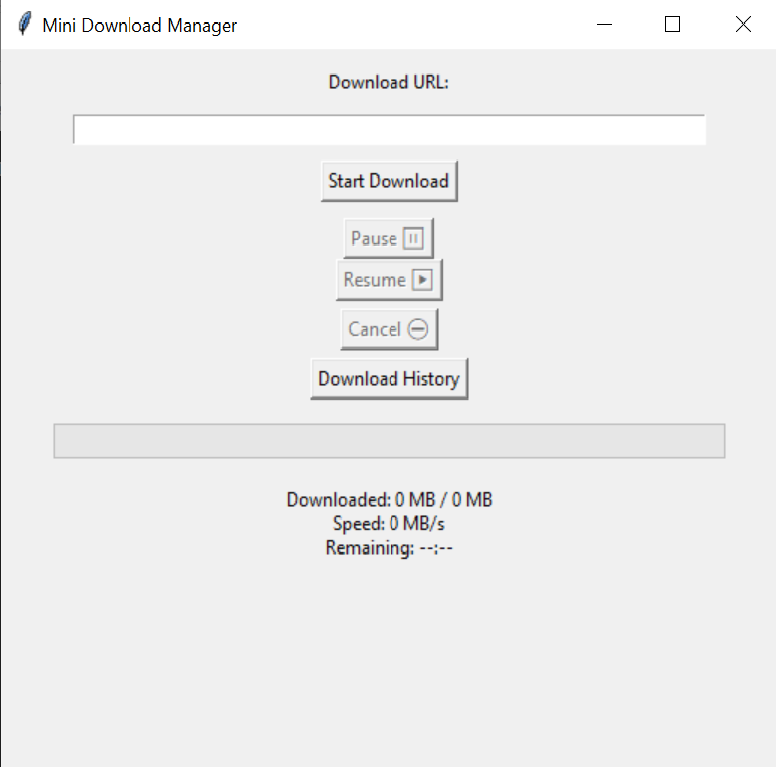

# Mini Download Manager 🚀

A simple desktop download manager built with Python and Tkinter.

This project was created to learn real-world Python concepts such as GUI development, threading, HTTP requests, file handling, and Git version control.

## Features ✨

- ✅ Download files from URLs
- ✅ Graphical User Interface (Tkinter)
- ✅ Progress bar
- ✅ Real-time download speed display
- ✅ Estimated time remaining (ETA)
- ✅ Resume interrupted downloads
- ✅ Cancel active downloads
- ✅ Download history
- ✅ JSON-based history storage
- ✅ Multi-threaded downloading

## Screenshots 📸



## Technologies Used 🛠️

- Python
- Tkinter
- Requests Library
- Threading
- JSON
- Git & GitHub

## Project Structure 📁

```text
python-download-manager/
│
├── main.py              # Main application source code
├── run.bat              # Windows launcher script
├── downloads.json       # Stores download information
├── MDM.png              # Application screenshot
├── README.md            # Project documentation
├── requirements.txt     # Python dependencies
└── .venv/               # Virtual environment (local only)
```
